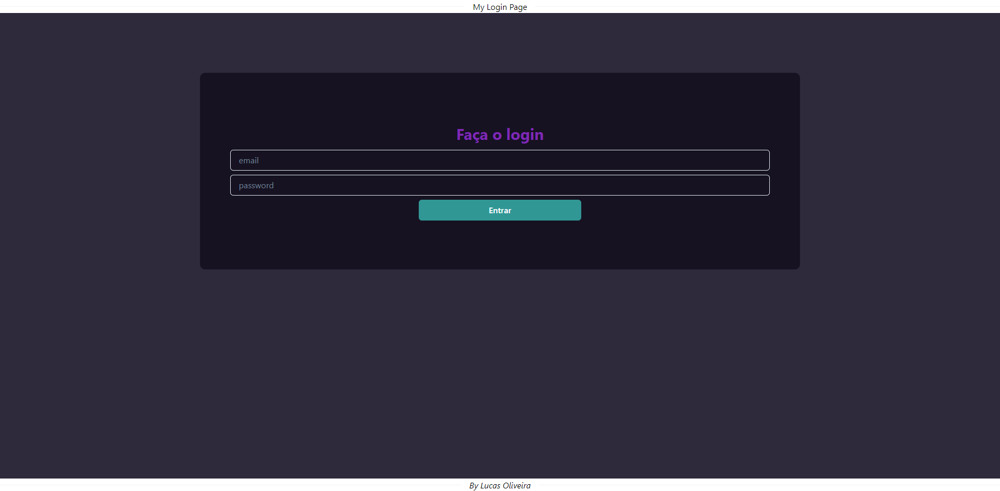

# Desenvolvendo um Formulário de Login
<i>desenvolvido por [Lucas Oliveira](https://github.com/olucasilva)</i>

### Tecnologias utilizadas
- [Typescript](https://www.typescriptlang.org/) para criação do código;
- Projeto desenvolvido com [React](https://react.dev/)
- Componentes estilizados com [Chakra UI](https://chakra-ui.com/)
- Validação de formulários com [React Hook Form](https://react-hook-form.com/)

### Prévia do projeto

### Como rodar o projeto

1 - Clone o repositório

2 - Instale as dependeências

    npm install react react-dom

    npm i @chakra-ui/react @emotion/react @emotion/styled framer-motion

    npm install react-hook-form

3 - Execute o projeto

    npm start